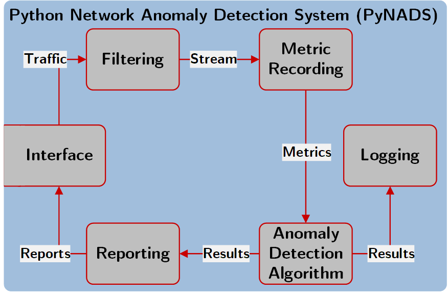
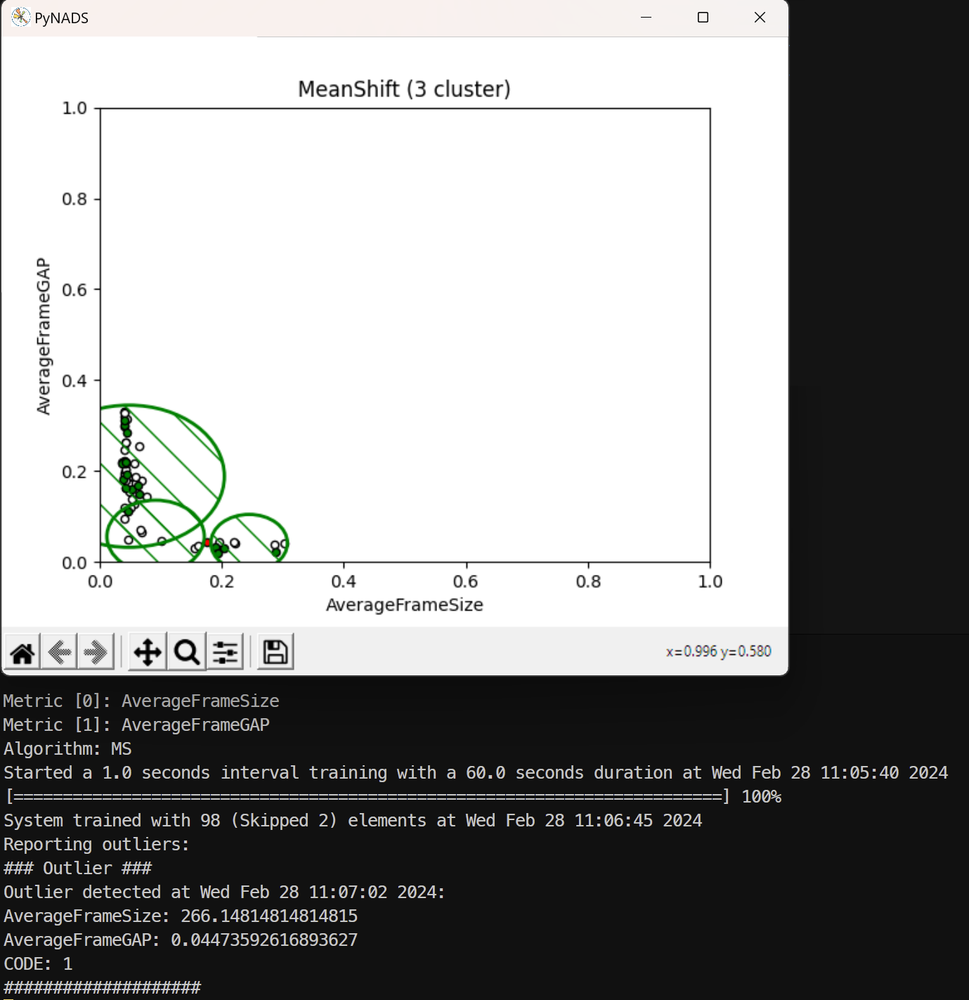

# PyNADS

PyNADS is a Python framework for network anomaly detection systems (NADS).
It provides a variety of options and arguments to control and customize the NADS.
Goal of PyNADS is to provide a flexible framework for reproducible comparison of NADS compositions.
Input data can be collected from network interfaces, PCAP files, or simulated data.
For example: The [NIDSDatasetCreation](https://github.com/CoRE-RG/NIDSDatasetCreation) is designed to generate labeled PCAP files that PyNADS is able to process.


## Summary
* **Two Phases**: A run is split into training and detection. In a training phase with configured length or data loaded from a file, the NADS learns the normal behavior. In the detection phase, the NADS detects anomalies in the network traffic until the program is closed.
* **Data Sources**: Support for various data sources, such as PCAP files, network interfaces.
* **Filter**: Support for filtering of input data.
* **Metrics**: Support for various network metrics, such as bandwidth, packet size etc.
* **Algorithms**: Support for various algorithms for network anomaly detection.
* **Modular**: PyNADS is designed to be modular, so that you can easily add new metrics, algorithms, data sources, and so on.


## Architecture



## Dependencies
* [Python 3.8](https://www.python.org/downloads/)
* See [requirements.txt](requirements.txt) for a list of required Python packages and versions.


## Usage
```
usage: PyNADS.py [-a ADALGORITHM] [--a-border-enlargement-factor A_BORDER_ENLARGEMENT_FACTOR] [--a-contamination A_CONTAMINATION] [--beep] [-f FILTER] [-h] [-i TRAININTERVAL] [-I INTERFACE] [-l LOAD] [--log-level LOG_LEVEL] [--log-file LOGFILE] [--log-summary-interval LOGSUMMARYINTERVAL] [-m {BANDWIDTH,AVG_FRAME_SIZE,AVG_FRAME_GAP,JITTER} [{BANDWIDTH,AVG_FRAME_SIZE,AVG_FRAME_GAP,JITTER} ...]] [-n NAME] [--pcapFile PCAP_FILE] [--plot] [--pyshark] [-q] [-r REPORTADDRESS] [--r-heartbeat-interval REPORTHEARTBEATINTERVAL] [--r-id REPORTID] [-s SAVE] [-S INTERFACE_SPEED] [--sim] [--simIP SIMIP] [--simPort SIMPORT] [--speak] [-t TRAINTIME] [-v] [-x {BANDWIDTH,AVG_FRAME_SIZE,AVG_FRAME_GAP,JITTER}] [-y {BANDWIDTH,AVG_FRAME_SIZE,AVG_FRAME_GAP,JITTER}]

optional arguments:
  -a ADALGORITHM, --ada ADALGORITHM, --adalgorithm ADALGORITHM
                        Anomaly detection algorithm {SVM, EE, IF, KM<number_of_clusters>, MS, HBO, AE}
  --a-border-enlargement-factor A_BORDER_ENLARGEMENT_FACTOR
                        The portion clusters are enlarged with after learning. (USED FOR KM and MS algorithms) | default=1.1
  --a-contamination A_CONTAMINATION
                        The amount of contamination of the learn data set, i.e. the proportion of outliers in the data set. (USED FOR SVM, EE, and IF algorithms) | default=0.1
  --beep                Sound feedback (experimental)
  -f FILTER, --filter FILTER
                        If Default or Pyshark socket: Berkeley Packet Filter (BPF) syntax (EXAMPLES: http://biot.com/capstats/bpf.html)
                        If Pcap file: Display Filter syntax (EXAMPLES: https://gitlab.com/wireshark/wireshark/-/wikis/DisplayFilters)
  -h, -?, --help        Print help
  -i TRAININTERVAL, --train-interval TRAININTERVAL
                        Train interval in seconds
  -I INTERFACE, --interface INTERFACE
                        Interface name
  -l LOAD, --load LOAD  Load train data from a file (skips training phase)
  --log-level LOG_LEVEL
                        Log level {DEBUG, INFO, WARNING, ERROR, CRITICAL} | default=INFO
  --log-file LOGFILE    Write output to a logging file
  --log-summary-interval LOGSUMMARYINTERVAL
                        Summary logging interval in seconds | default=60
  -m {BANDWIDTH,AVG_FRAME_SIZE,AVG_FRAME_GAP,JITTER} [{BANDWIDTH,AVG_FRAME_SIZE,AVG_FRAME_GAP,JITTER} ...], --metrics {BANDWIDTH,AVG_FRAME_SIZE,AVG_FRAME_GAP,JITTER} [{BANDWIDTH,AVG_FRAME_SIZE,AVG_FRAME_GAP,JITTER} ...]
                        Selection of metrics
  -n NAME, --name NAME  Name of the PyNADS instance
  --pcapFile PCAP_FILE  Use a pcap file instead of a network interface
  --plot                Show plot
  --pyshark             Use a Pysharksocket
  -q, --quiet           No output on command line
  -r REPORTADDRESS, --r-dst REPORTADDRESS, --report-destination REPORTADDRESS
                        MAC address a report should be forwarded to
  --r-heartbeat-interval REPORTHEARTBEATINTERVAL, --report-heartbeat-interval REPORTHEARTBEATINTERVAL
                        Interval of heartbeat reports in seconds | default=60
  --r-id REPORTID, --report-id REPORTID
                        ID of the NADS in report
  -s SAVE, --save SAVE  Save train data to file
  -S INTERFACE_SPEED, --Is INTERFACE_SPEED, --interfaceSpeed INTERFACE_SPEED
                        Interface speed in Mbit per second
  --sim                 Use data from an OMNeT++ simulation instead of an interface (filter not working)
  --simIP SIMIP         IP of the location of the running simulation
  --simPort SIMPORT     Port configured for the ExternalConnection of the simulation
  --speak               Spoken feedback (experimental)
  -t TRAINTIME, --trainTime TRAINTIME
                        Train time in seconds
  -v, --version         Print version
  -x {BANDWIDTH,AVG_FRAME_SIZE,AVG_FRAME_GAP,JITTER}, --mx {BANDWIDTH,AVG_FRAME_SIZE,AVG_FRAME_GAP,JITTER}, --metricx {BANDWIDTH,AVG_FRAME_SIZE,AVG_FRAME_GAP,JITTER}
                        Metric for x axis
  -y {BANDWIDTH,AVG_FRAME_SIZE,AVG_FRAME_GAP,JITTER}, --my {BANDWIDTH,AVG_FRAME_SIZE,AVG_FRAME_GAP,JITTER}, --metricy {BANDWIDTH,AVG_FRAME_SIZE,AVG_FRAME_GAP,JITTER}
                        Metric for y axis
```

## Examples

### Example 1: Monitor network interface

```PyNADS.py -I WLAN -S 1000 -x AVG_FRAME_SIZE -y AVG_FRAME_GAP -i 1 -t 60 -a MS --pyshark --plot```

In this example, the NADS is configured to monitor the WLAN interface. Max. interface speed is set to 1000 Mbit/s. The NADS calculates the average frame size and average frame gap, collect data every 1 second. It trains the system with data of a total of 60 seconds.
The used algorithm is mean-shift(MS) and the PyShark library is used to capture and filter packets.
The plot option is enabled, so the NADS will show a plot of the data after the training phase.
Output looks like the following screenshot:


### Example 2: Monitor network interface and send reports

```PyNADS.py -n EXAMPLE2_NADS --log-file output.log -I eth0 -S 1000 -a SVM -i 0.1 -t 600 -f "ip dst host 10.0.11.6 and udp dst port 1112" -r ffffffffffff --r-heartbeat-interval 30```

In this example, the NADS named "EXAMPLE2_NADS" is configured to monitor the eth0 interface. Max. interface speed is set to 1000 Mbit/s. 
Output is written to a log file called "output.log".
The NADS uses the support vector machine (SVM) algorithm and collects data every 0.1 seconds. It trains the system with data of a total of 600 seconds.
The interface input is filtered to only include packets with the destination IP 10.0.11.6 and the UDP port 1112.
In the detection phase the NADS sends reports on raised outlier events and a heartbeat every 30 seconds as a broadcast to MAC address 0xffffffffffff.

### Example 3: PCAP files as input and saving/loading of metrics

```PyNADS.py -S 1000 -m AVG_FRAME_SIZE AVG_FRAME_GAP BANDWIDTH JITTER -i 0.1 -t 100 -a HBO --pcapFile "train_trace.pcap" -f "frame.interface_description contains eth1 && udp.port == 2100" -s "saved_metrics.npy"```

In this example, the NADS is configured to use a pcap file as input. Max. interface speed is set to 1000 Mbit/s. The NADS calculates the average frame size, average frame gap, bandwidth, and jitter, collect data every 0.1 seconds. It trains the system with data of a total of 100 seconds.
The used algorithm is histogram-based outlier (HBO) and the pcap file is filtered to only include packets from the interface eth1 and with the UDP port 2100.
The metrics are saved to a file called "saved_metrics.npy".

```PyNADS.py -S 1000 -m AVG_FRAME_SIZE AVG_FRAME_GAP BANDWIDTH JITTER -i 0.1 -t 100 -a IF --pcapFile "test_trace.pcap" -f "frame.interface_description contains eth1 && udp.port == 2100" -l "saved_metrics.npy"``` 

In this example, the NADS is configured to use a pcap file as input. Max. interface speed is set to 1000 Mbit/s. The NADS calculates the average frame size, average frame gap, bandwidth, and jitter, collect data every 0.1 seconds. It trains the system with the data of the loaded metrics file "saved_metrics.npy".
The used algorithm is isolation forest (IF) and the pcap file is filtered to only include packets from the interface eth1 and with the UDP port 2100.


## Important Notice
PyNADS is under continuous development: new parts are added, bugs are corrected, and so on. We cannot assert that the implementation will work fully according to your specifications. YOU ARE RESPONSIBLE YOURSELF TO MAKE SURE THAT THE CONFIGURATION YOU USE WORKS CORRECTLY, AND YOU'RE GETTING VALID RESULTS.